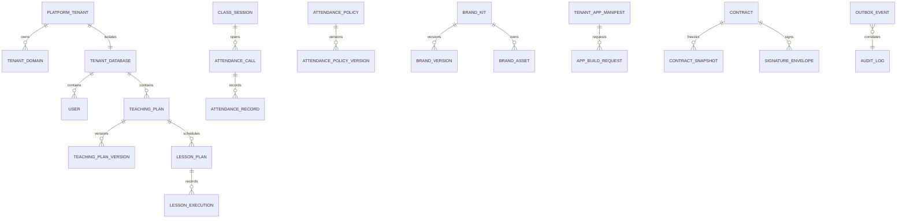

# Modelo de dados — visão condensada

```mermaid
erDiagram
  PLATFORM_TENANT ||--o{ TENANT_DOMAIN : owns
  PLATFORM_TENANT ||--|| TENANT_DATABASE : isolates
  TENANT_DATABASE ||--o{ USER : contains
  TENANT_DATABASE ||--o{ TEACHING_PLAN : contains
  TEACHING_PLAN ||--o{ TEACHING_PLAN_VERSION : versions
  TEACHING_PLAN ||--o{ LESSON_PLAN : schedules
  LESSON_PLAN ||--o{ LESSON_EXECUTION : records
  CLASS_SESSION ||--o{ ATTENDANCE_CALL : opens
  ATTENDANCE_CALL ||--o{ ATTENDANCE_RECORD : records
  ATTENDANCE_POLICY ||--o{ ATTENDANCE_POLICY_VERSION : versions
  BRAND_KIT ||--o{ BRAND_VERSION : versions
  BRAND_KIT ||--o{ BRAND_ASSET : owns
  TENANT_APP_MANIFEST ||--o{ APP_BUILD_REQUEST : requests
  CONTRACT ||--o{ CONTRACT_SNAPSHOT : freezes
  CONTRACT ||--o{ SIGNATURE_ENVELOPE : signs
  OUTBOX_EVENT }o--|| AUDIT_LOG : correlates
```

As migrations completas são a fonte normativa; este diagrama é somente uma visão de relacionamento.
