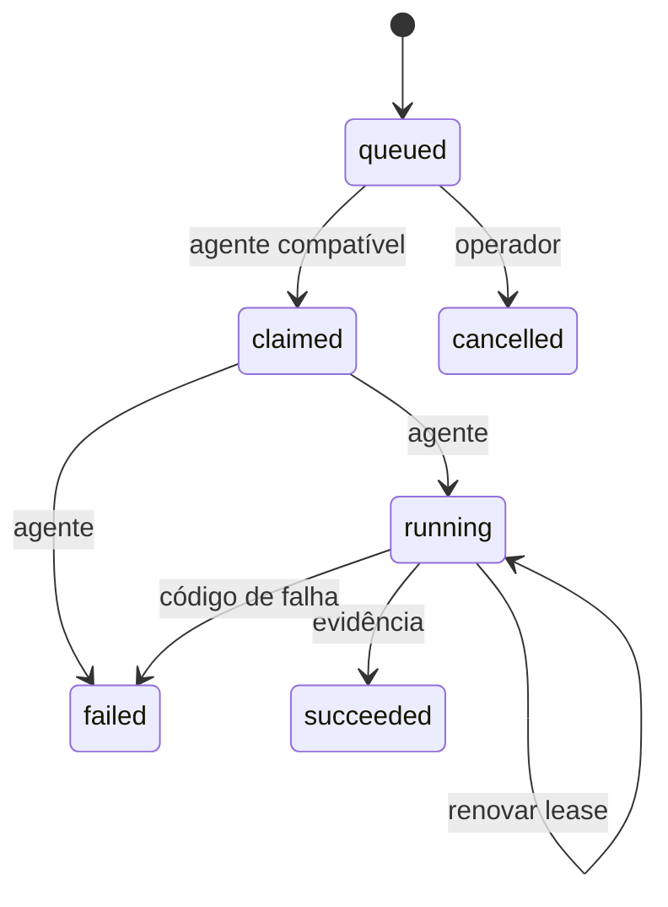

# Administração operacional do Control Plane

Este módulo registra agentes e coordena jobs de `backup`, `restore` e `deploy`.
Ele não possui executor de shell e não interpreta comandos, caminhos locais ou
payloads livres enviados pelo painel administrativo.

## Garantias do contrato

- O pedido administrativo nasce sempre em `queued`.
- Somente agentes ativos e com a capability correspondente podem reivindicá-lo.
- O token do agente é exibido uma única vez e apenas seu SHA-256 é persistido.
- Heartbeats usam horário do servidor; `stale` é calculado sem declarar o host morto.
- Lease expirado exige atenção manual e nunca reencaminha automaticamente restore/deploy.
- Transições usam versão otimista e são gravadas em auditoria/outbox.
- Resultado de sucesso exige código e referência de evidência; backup também exige SHA-256.
- Providers exibem apenas estado de configuração. O endpoint não faz probes externos e
  não retorna URL, hostname, zone ID, caminho de secret, token ou credencial.

## Capabilities

| Operação | Capability |
|---|---|
| Backup | `backup.execute` |
| Restore | `restore.execute` |
| Deploy | `deploy.execute` |

Um agente de tipo específico recebe somente sua capability. Agentes `host` e `multi`
podem receber mais de uma capability explícita.

## Estados de job

Jobs `claimed` ou `running` cujo lease venceu permanecem no mesmo estado, com
`attention_required=true`. Isso evita execução duplicada de uma restauração ou deploy.

## Integração do agente

O cadastro é restrito ao `platform_super_admin`. A resposta contém o token uma única
vez e usa `Cache-Control: no-store`. O agente envia esse valor no cabeçalho
`X-PIGE360-Agent-Token` para heartbeat, claim e transições.

O executor deve mapear cada operação para código previamente instalado e revisado.
`backup_reference`, `evidence_reference`, target, modo e versão são campos tipados;
nenhum deles deve ser convertido em linha de comando sem validação adicional no agente.

## Limites atuais

- Não há reatribuição automática de job abandonado.
- Não há scheduler de backup neste incremento.
- Não há processo de agente incluído; esta API apenas fornece o protocolo seguro.
- `configured_not_probed` não significa que o provider está saudável.
- A homologação de um executor exige Docker/PostgreSQL/MinIO e host reais.
