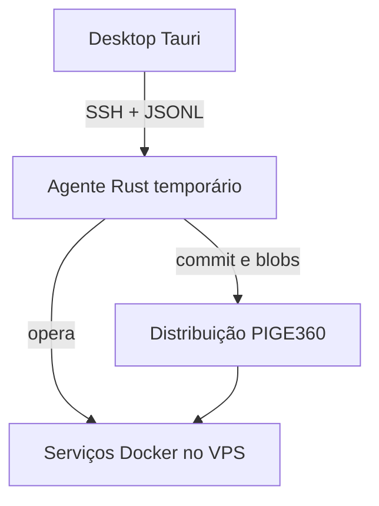
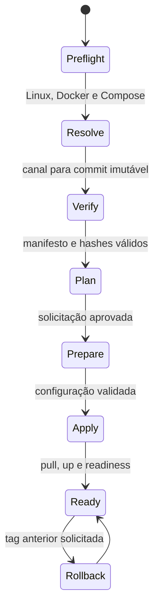
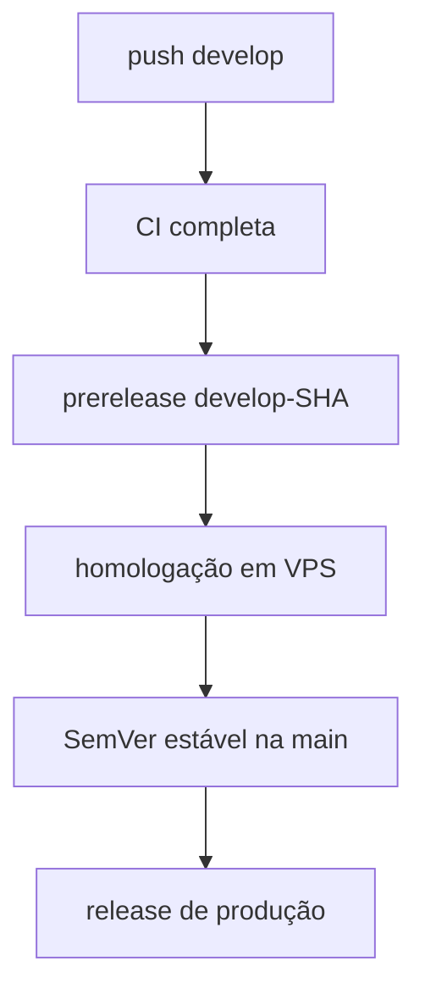

# Arquitetura operacional do PIGE360 Deployer

## Por que são mais de um serviço

Um único `compose.yaml` e um único `.env.example` descrevem estado, mas não
resolvem com segurança descoberta de versões, SSH, validação, backup, secrets,
readiness e rollback. O Deployer coordena três responsabilidades separadas sem
duplicar o conteúdo do deployment.

| Camada | Responsabilidade | Persistência |
| --- | --- | --- |
| Desktop Tauri | seleção, preflight, confirmação e progresso | configurações locais não sensíveis |
| Agente Rust Linux | integridade, staging, lock, backup, execução e recibo | removido ao terminar |
| Deployment versionado | Compose, `.env.example` e manifesto do target | pertence à versão do PIGE360 |
| Stack Docker | API, apps, banco, cache, filas, storage e observabilidade | volumes e secrets preservados |

## Fluxo de uma implantação

`plan` usa staging descartável e não altera a stack. `prepare` sincroniza a
configuração, inicializa o volume seguro de secrets e valida, mas não inicia nem
atualiza a aplicação. `apply` usa `docker compose pull/up` e executa o serviço
`pige360-readiness`. `rollback` troca para uma tag imutável e reaplica a mesma
orquestração service-native.

## Fonte de verdade

Cada instalação busca um destes caminhos na revisão PIGE360 resolvida:

| Target | Homologação | Produção |
| --- | --- | --- |
| Compose | `deployments/develop` | `deployments/production` |
| Dockge | `deployments/dockge/develop` | `deployments/dockge/production` |
| CloudPanel | `deployments/cloudpanel/develop` | `deployments/cloudpanel/production` |
| Portainer | `deployments/portainer/develop` | `deployments/portainer/production` |

O agente exige `.env.example`, `GENERATED-MANIFEST.json`, `SHA256SUMS`, README e
`compose.yaml` — ou `stack.yaml` no Portainer. O manifesto precisa declarar
schema 2 e modo `service-native-image-only`. Todo arquivo declarado é conferido
por SHA-256; cada blob baixado do GitHub também é conferido pelo SHA-1 Git.

Inicialização, configuração, migrations, readiness, secrets, backup, restore e
diagnóstico são implementados por serviços `pige360-*` do próprio Compose. O
agente não depende de scripts shell instalados no host e não recebe acesso ao
socket Docker dentro de containers administrativos.

## Canais e promoção

O canal `develop` resolve sempre a branch `develop` e converte o commit em
`develop-<sha12>` para as imagens. A prerelease publicada com essa mesma tag
é aceita somente em homologação. Produção exige release estável `X.Y.Z`.

## Falhas e diagnóstico

Saída do Docker Compose pode conter detalhes operacionais e por isso não é enviada
integralmente à interface. Ela fica no VPS com permissão `0600` em
`.state/deployer-logs/`; a mensagem de erro informa o caminho exato. Eventos
sem secrets e o recibo final são transmitidos em JSONL ao desktop.
